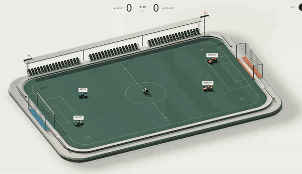
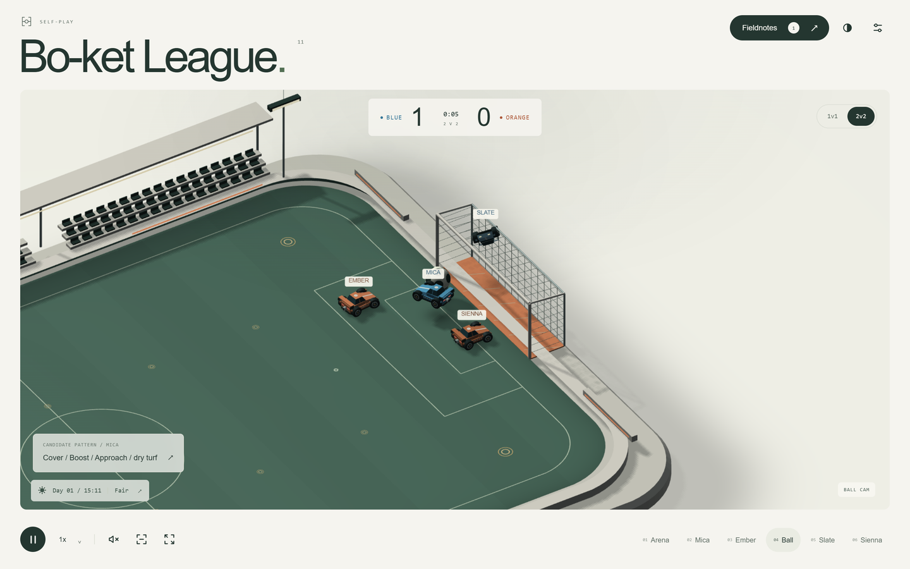
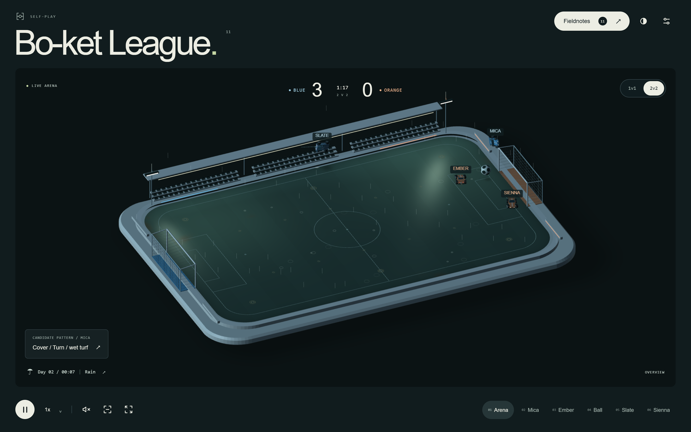
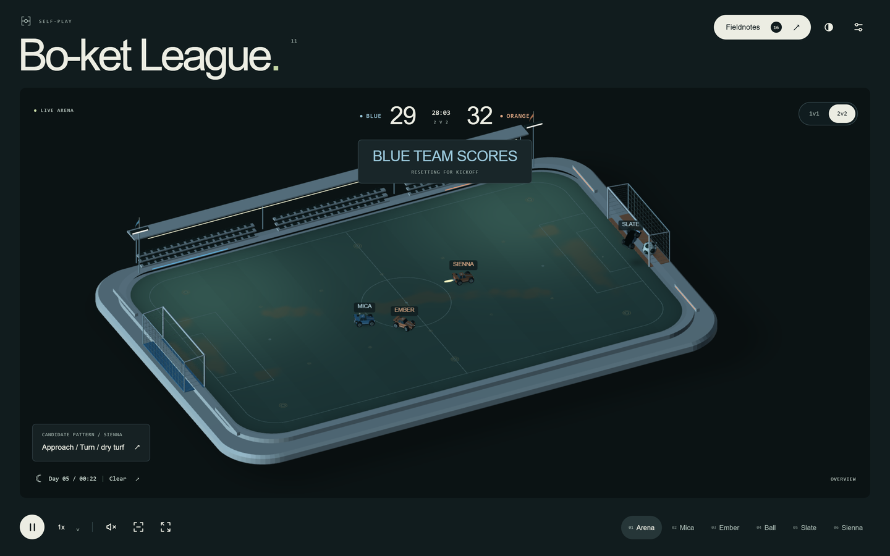
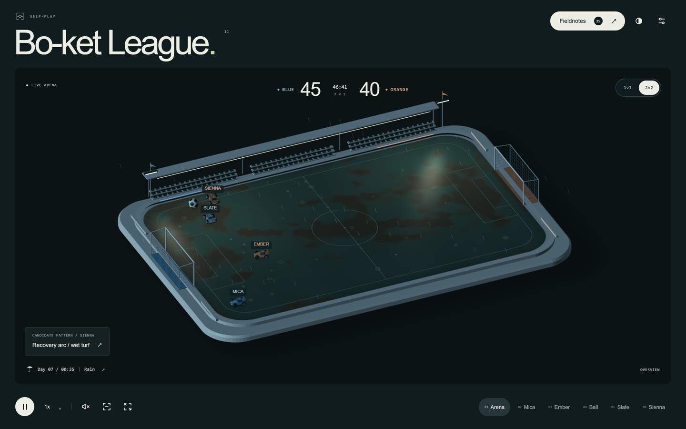
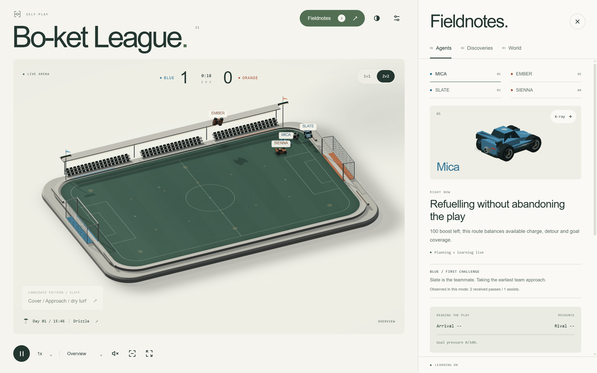
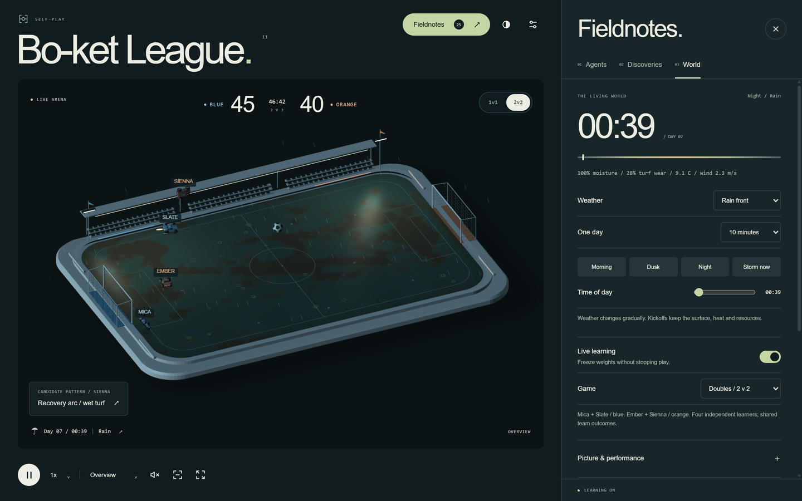

# Bo-ket League

Four cars teach themselves car-soccer inside a world that keeps changing around them: a day/night clock, weather fronts, and turf that wears into mud where they drive. It is one HTML file, runs offline, and needs nothing installed to play.



## Run it

Open `index.html` in any modern browser. Nothing is fetched, installed or signed into.

```sh
git clone https://github.com/rebantamandal/bot-ket_league.git
cd bot-ket_league
# then open index.html — or, to work on the source:
npm install && npm run dev      # rebuilds index.html whenever src/ changes
```



## The world

The simulation runs at a fixed 120 Hz in a Web Worker, so the interface never changes what happens on the pitch.

| | |
|---|---|
|  | **Weather that shows.** The sun follows the world clock, so shadows swing round through the day, warm at dusk and give way to floodlights. Rain slants with the wind and splashes on the turf, cloud shadows drift, flags stream, mist settles on still mornings. |
|  | **Turf wear.** Tyres and boost scuff the grass under both wheel tracks. Nothing decides where the paths go — they appear where the cars actually drive, and grass regrows in sun and moisture. |
|  | **Mud.** Rain turns worn ground to mud, and mud costs grip. The planner already weighs grip along its route, so the cars start avoiding the lanes they wore out. |

Also live: moisture and heat spreading across a 64×40 surface grid, evaporation, engine heat, finite boost pads that recharge slower on hot ground, physical props, and an optional cellular life layer (Conway, or an ecological variant that reacts to moisture and tyres).

## The cars



Each car plans a few hundred milliseconds ahead: it predicts the ball's path, lists candidate plans (strike, clear, shadow the goal, refuel, support, pass), scores them, and drives the winner with a hand-written controller. A small online learner (TD(λ) over 64 features) adjusts those scores from experience while it plays.

- **Shot placement** aims at the part of the goal no defender between ball and net can cover, using where they will be when the shot arrives.
- **Aerials**: with boost in the tank, a car commits early to a high ball and flies to the intercept.
- **Temperament**: every car draws a fixed bias for aggression, patience, boost appetite and flair, so the four do not play alike. It is saved with the policy and shown as plain numbers in Fieldnotes.
- **Momentum and mood**: a team two goals down commits more, a team two up holds shape, and each round carries a mood of its own, so long sessions do not settle into one rhythm.
- **Teamwork in 2v2** is a reach-time coordinator with hysteresis: one challenger per side, the other covering. Passes are ordinary physical contacts aimed at a teammate — nothing teleports the ball.

Driving, interception and rotation are authored. Learning adjusts preferences between plans within bounded limits; it does not invent new skills.

## Watching and poking



- **Cameras**: overview, per-car follow, ball cam, free orbit. A camera director cuts to the ball on goals and hands the view back.
- **Tools**: place water, heat, a heavy ball, an impulse or a wind gust anywhere on the pitch; force a storm; scrub the time of day.
- **Fieldnotes**: what each car intends and why, the plans it compared, its learned weights, and a journal of repeated approaches with outcome intervals.
- **History**: policy snapshots, frozen head-to-head comparisons over matched seeds, and branch-a-moment what-ifs — all in a second worker, so live play never stalls.
- **Saves**: the full world (physics, weather, surface, learners, replays) exports to a JSON file and restores exactly.

## Controls

| Input | Action |
|---|---|
| `P` / `Space` | Pause and resume |
| `1`–`6` | Cameras: arena, Mica, Ember, ball, Slate, Sienna |
| `[` `]` | Simulation speed, 0.5× to 4× |
| `I` · `H` · `F` | Fieldnotes · focus view · fullscreen |
| Drag the arena | Orbit the camera |
| WASD / arrows · Shift · Space · Ctrl · Q/E | Drive Mica: steer · boost · jump · powerslide · air roll |
| Gamepad | Start takes control; stick steers and pitches, triggers drive, A jumps, B boosts, X powerslides, bumpers air-roll |

## How it is built

```
build.py  →  index.html         one file, four inline scripts, no assets
                ├── worker      math, weather, field, physics, agents, observer, state, evaluation, runtime
                └── page        renderers (WebGL2 with a Canvas fallback) and the interface
```

| File | Role |
|---|---|
| `src/physics.js` | Arena, cars, ball, collisions, rewards, events |
| `src/agents.js` | Plan generation, scoring, learning, driving controller, 2v2 coordinator |
| `src/field.js`, `src/weather.js` | Surface moisture, heat, wear and life; day/night and weather fronts |
| `src/observer.js` | Read-only pattern journal and replay clips |
| `src/state.js`, `src/evaluation.js`, `src/runtime.js` | Saves, frozen comparisons, the worker loop |
| `src/renderer-atelier.js` | WebGL2 scene and the cached Canvas renderer |
| `src/app.js` | Worker bridge, interface, input, audio |

## Measuring the AI

Claims about the AI are checked, not asserted. `npm run ai:bench` plays the current planner against the one in git, every seed twice with the sides swapped and learning frozen:

```sh
npm run ai:bench -- --games 400        # goal difference with a 95% interval
npm run ai:tune                        # search the authored constants against that baseline
```

Identical planners score exactly level, so a result inside the interval means no measured change. The current planner measures **+0.17 goals per game in 1v1** (95% CI 0.00–0.33) and **−0.06 in 2v2** (−0.23 to +0.10) against the previous one over 400 games per mode, with 8–16% fewer own goals. Several plausible ideas — a full-boost kickoff rush, back-post rotation, a round of constant tuning — measured worse or flat and were dropped.

## Development

Requirements: Node.js 18+ and Python 3 (standard library only). The built page needs neither.

```sh
npm run build            # build index.html
npm run format           # Prettier over src/, tests/ and tools/
npm test                 # 52 engine tests
npm run test:build       # deterministic rebuild and syntax audit
npm run fingerprint      # hash 90 s of seeded play; compare before and after a refactor
```

Browser tests need Playwright in a local virtual environment:

```sh
python -m venv .venv
.venv/Scripts/python -m pip install playwright        # .venv/bin/python on macOS and Linux
.venv/Scripts/python -m playwright install chromium
.venv/Scripts/python tests/doubles-browser.test.py    # likewise fieldunit- and world-browser
```

They inject the built page and drive the real worker, renderer and controls: 186 checks across the three suites, including real WebGL rendering and recovery from a lost GPU context where a GPU is available.

## Limits

- The learner adjusts scores between authored plans within bounded limits. It is not end-to-end neural control, and a rising update count is not evidence of a stronger car.
- The observer's journal reports matched-context intervals; self-play attempts are not independent experiments.
- Replays store quantised visual samples. Physics, random state and learned values never use that quantisation.
- Autosave depends on browser storage; the exported world file is the reliable backup.

An original car-soccer experiment. Not Rocket League, and not a trained Rocket League bot.
